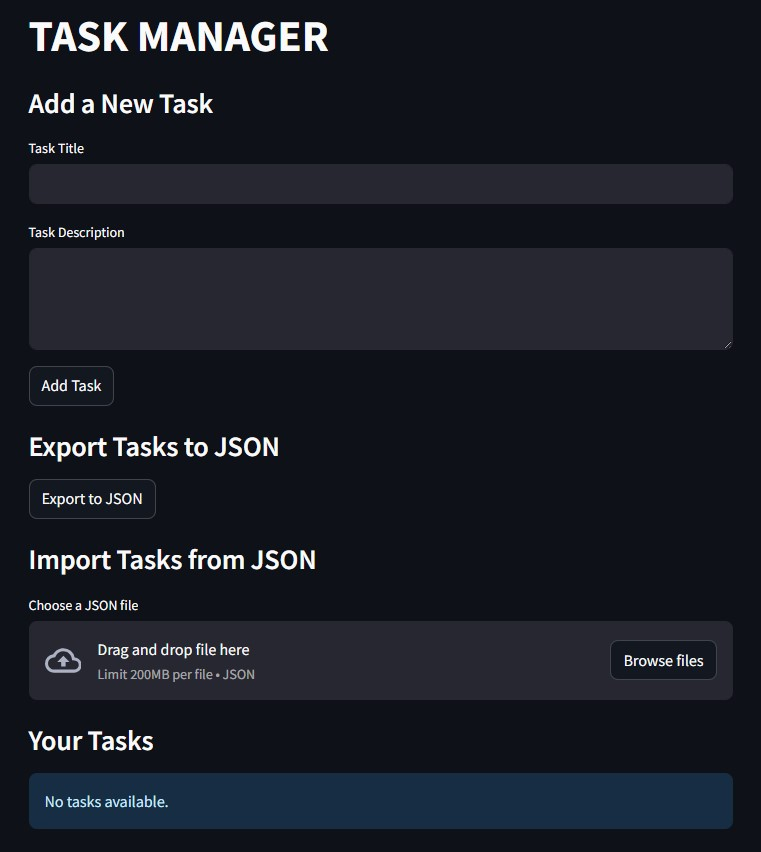
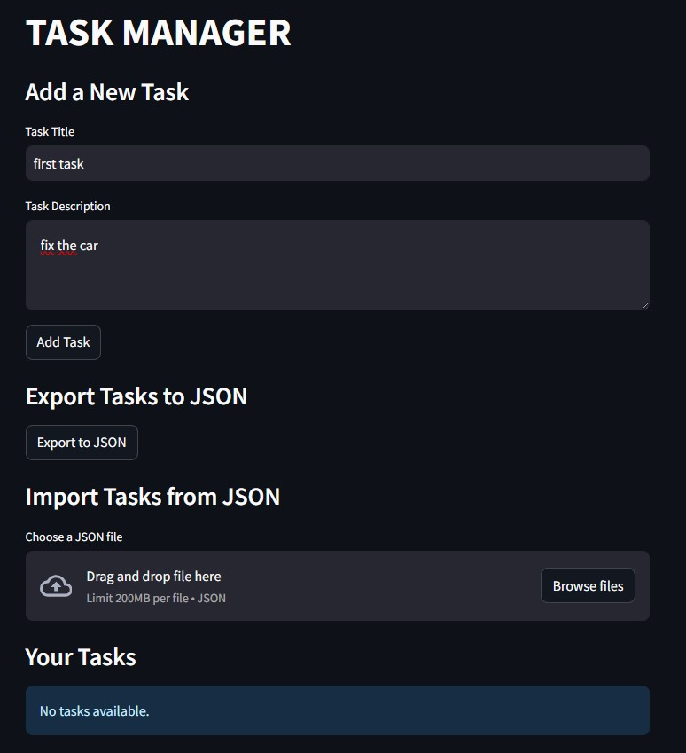
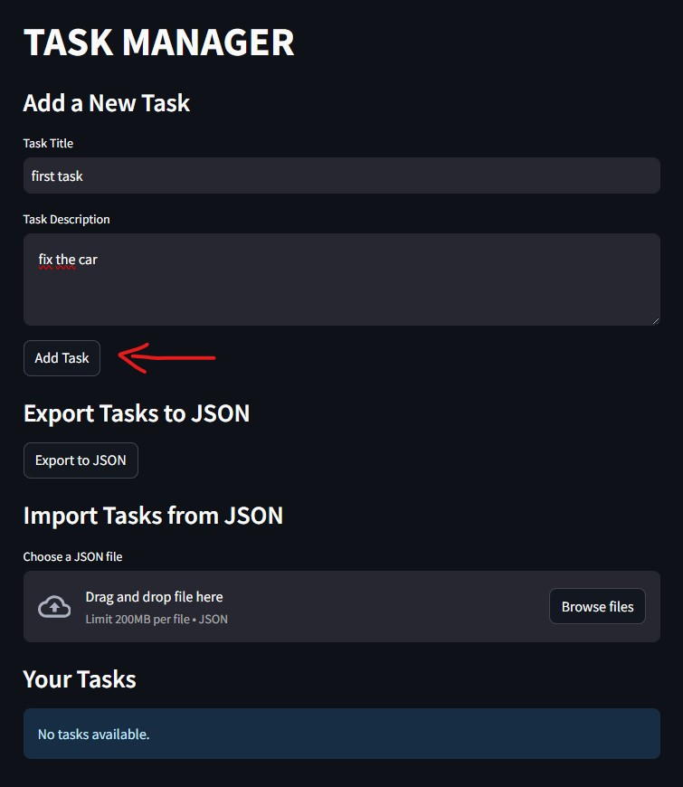
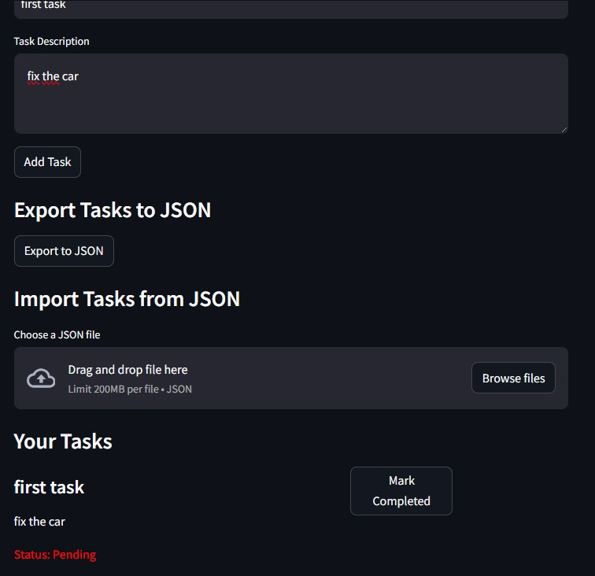
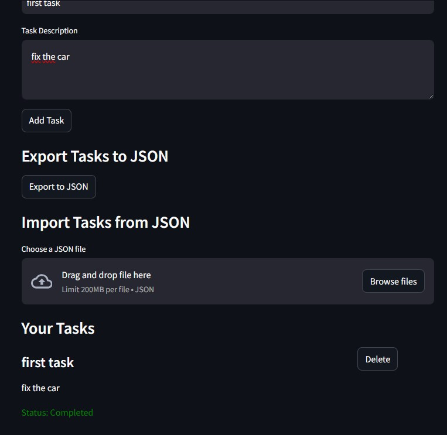
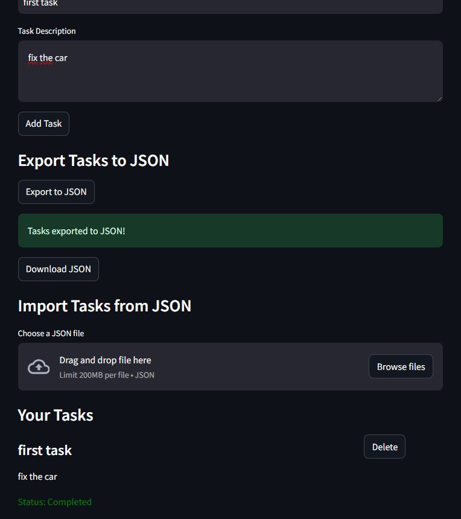
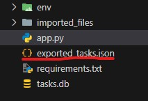
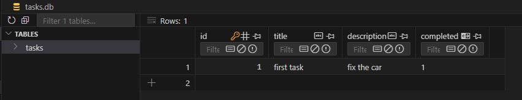
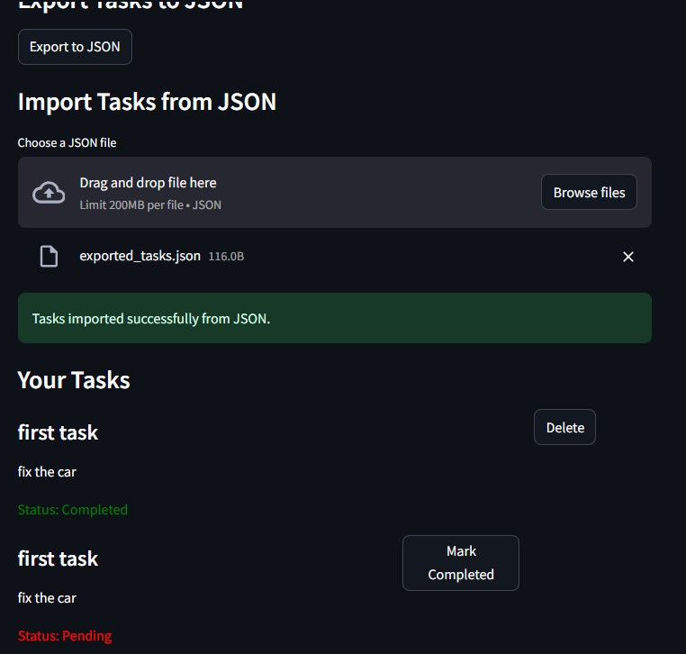

# Task Manager Application

This repository contains a Python-based Task Manager application built using **Streamlit** for the front end and **SQLAlchemy** for database interactions. The application allows users to manage tasks with features like creating, completing, deleting, and importing/exporting tasks in JSON format.

## Features

- **Add New Tasks**: Users can create tasks with a title and description.
- **View Tasks**: Displays all tasks with their statuses (Completed or Pending).
- **Mark Tasks as Completed**: Allows marking tasks as completed.
- **Delete Completed Tasks**: Users can delete tasks marked as completed.
- **Export Tasks to JSON**: Saves all tasks to a JSON file for backup or sharing.
- **Import Tasks from JSON**: Load tasks from a JSON file.

### Screenshots

#### Adding a New Task
- start of the website: 
- writing the task: 
- Adding the task using the submit button: 

#### Task Added Successfully
- Task displayed after being added: 

#### Marking a Task as Completed
- Task marked as completed: 

#### Exporting Tasks to JSON
- Exporting tasks as a JSON file: 
- Generated JSON file: 

#### Database View
- SQLite database created after adding a new task: 

#### Importing Tasks from JSON
- JSON file being imported: 

## Installation

1. Clone the repository:
   ```bash
   git clone https://github.com/your_username/task-manager.git
   cd task-manager
   ```

2. Install the required dependencies:
   ```bash
   pip install -r requirements.txt
   ```

3. Run the application:
   ```bash
   streamlit run app.py
   ```

## Code Structure

### Database Configuration

The application uses **SQLite** as the database engine. The `Task` model defines the structure of tasks in the database:

- `id` (Integer): Unique identifier for each task.
- `title` (String): Title of the task.
- `description` (String): Description of the task.
- `completed` (Boolean): Status of the task.

The database is initialized using SQLAlchemy's ORM.

### Core Functions

- **Database Management**:
  - `get_db()`: Creates and manages database sessions.
  - `load_tasks(db)`: Fetches all tasks from the database.
  - `save_task(db, title, description)`: Adds a new task to the database.
  - `mark_completed(db, task_id)`: Marks a task as completed.
  - `delete_task(db, task_id)`: Deletes a task from the database.

- **JSON Import/Export**:
  - `export_to_json(db)`: Exports all tasks to a JSON file.
  - `import_from_json(uploaded_file, db)`: Imports tasks from a JSON file.

### User Interface

The application uses **Streamlit** to create an interactive web interface:

- **Task Management**:
  - Input fields for title and description.
  - Buttons to add tasks, mark them as completed, and delete tasks.
- **JSON Import/Export**:
  - Button to export tasks to JSON with a download option.
  - File uploader to import tasks from a JSON file.
- **Task Display**:
  - Displays each task with options to update or delete.

### Error Handling

- JSON file uploads are validated to ensure compatibility.
- Displays messages for successful or failed operations.

## Usage

1. Open the application in a browser after running the `streamlit` command.
2. Add tasks by entering a title and description.
3. Manage tasks using the options provided:
   - Mark tasks as completed.
   - Delete completed tasks.
4. Use the **Export to JSON** button to back up your tasks.
5. Import tasks from a JSON file using the **Import from JSON** uploader.

## Requirements

- Python 3.7+
- Streamlit
- SQLAlchemy

Install all dependencies using the provided `requirements.txt` file.

## Future Improvements

- Add user authentication for personalized task lists.
- Implement filtering and sorting options.
- Enhance the interface with custom themes and CSS.

## License

This project is licensed under the MIT License. See the LICENSE file for details.

## Contributing

Contributions are welcome! Please fork the repository and create a pull request for any improvements or bug fixes.

## Acknowledgments

- [Streamlit Documentation](https://docs.streamlit.io/)
- [SQLAlchemy Documentation](https://docs.sqlalchemy.org/)
